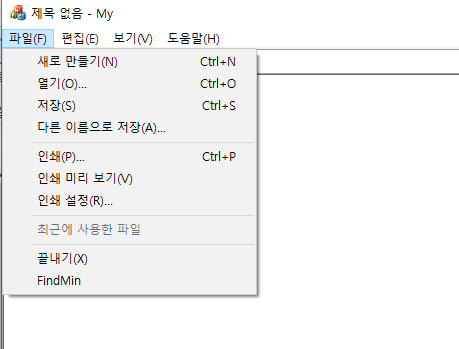
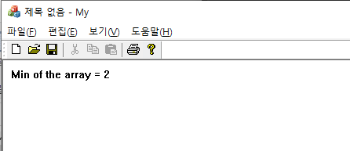

# 231031

20191276 컴퓨터공학과 양용석</br>

멀티스레드를 이용한 10개의 정수 배열에서 최소값 구하기</br>

```
//My.h 에서 WM_MIN 정의
#ifndef __AFXWIN_H__
#endif

#include "resource.h"       // 주 기호입니다.
#define WM_MIN (WM_USER+1)
```

```
//MyView.h에서 구조체 SData 정의, 정수 배열 설정 및 최소값을 가지는 정수값 선언, 
struct SData 
{
	int array[10] = { 11,3,2,6,7,4,8,10,9,5 };
	int min = 1;
	HWND NotifyWindow;
```

```
//메뉴에서 ID_FINDMIN 의 ID를 가지는 최소값을 찾는 메뉴 생성, MyView.cpp 코드
BEGIN_MESSAGE_MAP(CMyView, CView)
	// 표준 인쇄 명령입니다.
	ON_COMMAND(ID_FILE_PRINT, &CView::OnFilePrint)
	ON_COMMAND(ID_FILE_PRINT_DIRECT, &CView::OnFilePrint)
	ON_COMMAND(ID_FILE_PRINT_PREVIEW, &CView::OnFilePrintPreview)
	ON_COMMAND(ID_FINDMIN, &CMyView::OnFindmin)
	ON_MESSAGE(WM_MIN, &CMyView::OnMinFound)
END_MESSAGE_MAP()
...
//OnDraw 함수
void CMyView::OnDraw(CDC* pDC)
{
	CMyDoc* pDoc = GetDocument();
	ASSERT_VALID(pDoc);
	if (!pDoc)
		return;
	pDC->TextOut(10,10, pDoc->str);
}
...
//스레드 생성 , 포인터 설정
UINT MyThread(LPVOID pParam);
UINT MyThread(LPVOID pParam)
{
	SData* pData = (SData*)pParam;
	int min = pData->array[0];
	for (int i = 1; i < 10; i++) {
		if (pData->array[i] < min) {
			min = pData->array[i];
		}
	}
	//메시지 출력
	pData->min = min;

	::PostMessage(pData->NotifyWindow, WM_MIN, 0, 0);
	return 0;

}
//초기 최소값 설정
void CMyView::OnFindmin()
{
	data.min = 1;	
	data.NotifyWindow = m_hWnd;
	AfxBeginThread(MyThread, &data);
}
//최소값 찾기 후 출력
LRESULT CMyView::OnMinFound(WPARAM wParam, LPARAM lParam)
{
	CMyDoc *pDoc = GetDocument();
	ASSERT_VALID(pDoc);
	CString msg;
	msg.Format(L"Min of the array = %d", data.min);
	pDoc->str = msg;
	TerminateThread(Thread, 0);
	Invalidate();
	return 0L;
}

```
실행 화면</br>

 </br>
 </br>
